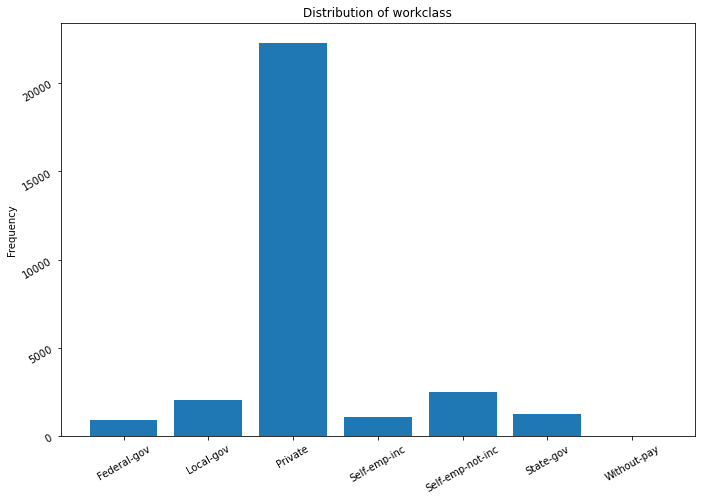

### ML Case Study

#### Objective
Develop income classifier of an individual whether the income is more than $50K per year or less than or equal to $50K per year based on [Census data](http://archive.ics.uci.edu/ml/datasets/Adult). As we know that exact income of individual is not available publicly. So, It can help us to know more about the individual customer. This information can be use in further decision making like Loan Disbursement by lending company, provide Subsidy to individuals by Government and insurance company to mitigate risk of insurance.

#### Data and Exploratory Data Analysis (EDA)
Data contains various attributes of individual which can help us to explore about individual and predictive analytics.

Following attributes with insights about them:  
<b>Categorical variables:</b>
<ol>
    <li><strong>workclass:</strong> It contains type of work class he/she do. Unique categories exist like Private, Self-emp-not-inc, Local-gov, State-gov, Self-emp-inc, Federal-gov, Without-pay and Never-worked. It also contains 1836 missing values with ' ?' filled value.</li>
    
    <li><strong>education:</strong>It represents the educational level of individual. Overall 16 level are exist this dataset. There is No missing value for it.</li>
    
</ol>